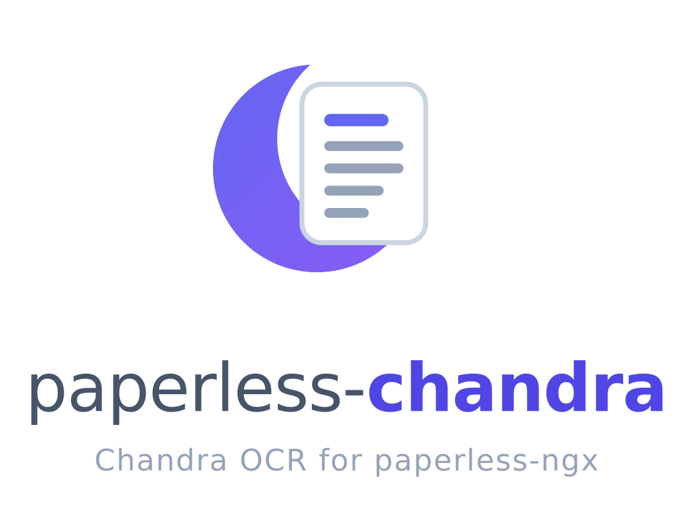

<!-- markdownlint-disable-file MD033 MD041 -->
<div align="center">
  <picture>
    <source media="(prefers-color-scheme: dark)" srcset="assets/logo-dark.png">
    
  </picture>
</div>

A [Chandra OCR](https://github.com/datalab-to/chandra) provider for
[paperless-ngx](https://github.com/paperless-ngx/paperless-ngx), delivered as a parser plugin that
replaces the built-in Tesseract OCR pipeline with a self-hosted deployment of
`datalab-to/chandra-ocr-2`, a ~5B-parameter vision-language OCR model built on a Qwen 3.5 base.

Paperless continues to drive `ocrmypdf` exactly as before. Existing OCR configuration
(`PAPERLESS_OCR_LANGUAGE`, `PAPERLESS_OCR_MODE`, `PAPERLESS_OCR_OUTPUT_TYPE`, `PAPERLESS_OCR_DESKEW`, …)
keeps working, and archive PDFs remain PDF/A.

> [!NOTE]
> Requires paperless-ngx 3.x (currently in beta) with the parser plugin system (the
> `paperless_ngx.parsers` entry-point group). On older releases the entry point is not discovered
> and the plugin is silently inactive.

## Features

- Drop-in replacement for the built-in Tesseract OCR pipeline
- Honours every `PAPERLESS_OCR_*` setting (mode, output type, deskew, pages, clean, user args, …)
- 90+ languages and mixed scripts recognized in a single pass, with no per-language configuration
- Complex layout, tables, and handwriting handled by a ~5B-parameter vision-language model
- Document content stored as plain text or markdown (`PAPERLESS_CHANDRA_CONTENT_FORMAT`)
- Works with any OpenAI-compatible inference server (vLLM reference deployment)

## Requirements

- A self-hosted, OpenAI-compatible inference server running Chandra. vLLM is the reference
  deployment ([`examples/docker-compose.vllm.yml`](examples/docker-compose.vllm.yml)); any server
  exposing the same `/v1/chat/completions` API works.
- Full-precision (bf16) inference needs a GPU in the ~24 GB class (L4, RTX 4090, or larger) using
  the flags documented in the compose example below. Quantized GGUF checkpoints served through a
  compatible server fit on smaller GPUs, or run on CPU alone at reduced speed - see
  [Performance notes](#performance-notes).

> [!NOTE]
> The paperless container itself stays CPU-only and needs no GPU or extra native libraries; only
> the inference server needs one.

## Installation

Build the plugin into a custom paperless-ngx image, or bootstrap it into an existing container.
Pick the method that matches your environment:

| Method | When to use |
| --- | --- |
| **A. Custom Docker image (recommended)** | Docker / Docker Compose deployments. |
| **B. Bootstrap script** | Managed paperless containers where you can mount into `/custom-cont-init.d/` but cannot rebuild the image. |
| **C. Non-Docker host install** | paperless-ngx running directly on a host / VM. |

### A. Custom Docker image (recommended)

[`examples/Dockerfile`](examples/Dockerfile) fetches the plugin source from this repository at
build time, builds the wheel, and layers it onto `ghcr.io/paperless-ngx/paperless-ngx:beta`:

```bash
docker build \
    --build-arg PLUGIN_REF=v0.1.0 \
    -f examples/Dockerfile \
    -t paperless-chandra:latest .
```

Build args:

- `PLUGIN_REF` - Git ref to build the plugin from. Use a release tag (`v0.1.0`) for reproducible
  builds; `master` tracks the latest snapshot.
- `PAPERLESS_TAG` - paperless-ngx base image tag (default `beta`).

The result is a drop-in replacement for `ghcr.io/paperless-ngx/paperless-ngx:beta`. Compose
example: [`examples/docker-compose.vllm.yml`](examples/docker-compose.vllm.yml).

### B. Bootstrap script (Compose, no custom image)

For paperless deployments where mounting into `/custom-cont-init.d/` is easier than rebuilding the
image, [`setup.sh`](setup.sh) installs a pre-built plugin artifact placed next to it. paperless-chandra
is not published to PyPI, so build one first, either with `pip wheel` or the version-controlled
build recipe:

```bash
# Either:
pip wheel --no-deps "git+https://github.com/flobernd/paperless-chandra.git@v0.1.0"

# ...or, using docker/builder.Dockerfile:
docker build -f docker/builder.Dockerfile -t paperless-chandra-builder .
docker create --name extract paperless-chandra-builder
docker cp extract:/dist/. ./dist
docker rm extract
```

Mount the resulting `paperless_chandra-*.whl` (or a `paperless-chandra.tar.gz` sdist) alongside
`setup.sh` under `/custom-cont-init.d/`. The script installs no native libraries and no inference
runtime of its own; the install is idempotent across container restarts.

### C. Non-Docker host install

```bash
pip install "git+https://github.com/flobernd/paperless-chandra.git@v0.1.0"
```

No extra native libraries are needed beyond what `ocrmypdf` and `chandra-ocr` already pull in.
Then restart paperless-ngx; the parser is discovered via its `paperless_ngx.parsers` entry point.

## Docker Compose Example

Trimmed excerpt of a stack pairing paperless-ngx (CPU only) with a GPU sidecar running Chandra
through vLLM. Requires `CHANDRA_API_KEY` in a `.env` file alongside the compose file; the full
stack below additionally needs `PAPERLESS_DB_USER` and `PAPERLESS_DB_PASSWORD`.

```yaml
services:
  paperless:
    build:
      context: .
      dockerfile: Dockerfile
      args:
        PLUGIN_REF: ${PLUGIN_REF:-master}
    image: paperless-chandra:latest
    restart: unless-stopped
    depends_on:
      - chandra-server
    volumes:
      - paperless_data:/usr/src/paperless/data
      - paperless_media:/usr/src/paperless/media
    environment:
      PAPERLESS_OCR_LANGUAGE: eng
      PAPERLESS_CHANDRA_SERVER_URL: http://chandra-server:8000
      PAPERLESS_CHANDRA_MODEL_NAME: chandra
      PAPERLESS_CHANDRA_API_KEY: ${CHANDRA_API_KEY:?missing CHANDRA_API_KEY in .env}

  chandra-server:
    image: vllm/vllm-openai:v0.17.0
    restart: unless-stopped
    command:
      - --model=datalab-to/chandra-ocr-2
      - --served-model-name=chandra
      - --api-key=${CHANDRA_API_KEY:?missing CHANDRA_API_KEY in .env}
      - --dtype=bfloat16
      - --max-model-len=18000
    deploy:
      resources:
        reservations:
          devices:
            - driver: nvidia
              capabilities: ["gpu"]
              count: 1

volumes:
  paperless_data:
  paperless_media:
```

Full ready-to-run stack (database, Redis, consume directory, and the complete vLLM launch flags):
[`examples/docker-compose.vllm.yml`](examples/docker-compose.vllm.yml).

On first startup the container will:

1. Build (or pull, if already built) the custom image - the plugin comes baked in.
2. Discover this package via the `paperless_ngx.parsers` entry point. Look for this log line:

   ```text
   Loaded third-party parser 'Paperless-ngx Chandra Parser' v0.1.0 by Florian Bernd (entrypoint: 'chandra').
   ```

3. Route ingested documents through Chandra instead of Tesseract.

### Updating

Rebuild the custom image with a newer `PLUGIN_REF` and recreate the container. The `chandra-server`
sidecar is updated independently by pulling a newer `vllm/vllm-openai` image tag.

## Environment

The plugin reads its own configuration from `PAPERLESS_CHANDRA_*` environment variables. All
standard `PAPERLESS_OCR_*` variables (see
[Honoured paperless-ngx settings](#honoured-paperless-ngx-settings)) keep working unchanged.

| Variable | Default | Description |
| --- | --- | --- |
| `PAPERLESS_CHANDRA_SERVER_URL` | *(required)* | URL of the OpenAI-compatible inference server hosting Chandra, for example `http://gpu-host:8000`. The `/v1` suffix is appended automatically when missing. |
| `PAPERLESS_CHANDRA_MODEL_NAME` | `chandra` | Served model name the inference server advertises. Matches the vLLM launcher default; override it when your server advertises a different name. |
| `PAPERLESS_CHANDRA_API_KEY` | *(unset)* | Bearer token for the server. When unset, the vLLM convention `EMPTY` is sent instead. |
| `PAPERLESS_CHANDRA_MAX_OUTPUT_TOKENS` | `12384` | Per-page output token budget passed to the inference server. Lower it to keep slow CPU inference inside the client timeout (see [Troubleshooting](#troubleshooting)). |
| `PAPERLESS_CHANDRA_CONTENT_FORMAT` | `text` | `text` or `markdown`. Selects what paperless stores as document content; the invisible PDF text layer underneath is always plain text. |
| `PAPERLESS_CHANDRA_SCORE` | `15` | Parser-registry priority. Higher scores win when more than one parser claims the same MIME type; the built-in Tesseract parser scores `10`, so the default makes Chandra preferred whenever this plugin is installed. |

> [!NOTE]
> `markdown` mode only changes the sidecar and stored document content; the invisible PDF text
> layer is always plain text. When paperless extracts text from the archive PDF instead of the
> sidecar (for example in `redo` mode), the stored content is plain text regardless of
> `PAPERLESS_CHANDRA_CONTENT_FORMAT`.

## Honoured paperless-ngx settings

All `PAPERLESS_OCR_*` settings are honoured transparently - they are read from the same `OcrConfig`
dataclass that the Tesseract parser uses, then passed to `ocrmypdf.ocr()` exactly the same way:

| Setting | Effect |
| --- | --- |
| `PAPERLESS_OCR_LANGUAGE` | Tesseract codes, `+`-separated. See below - Chandra does not map these to a model choice. |
| `PAPERLESS_OCR_MODE` | `auto` / `force` / `redo` / `off` (`off` skips OCR entirely and just produces PDF/A - Chandra is not invoked). |
| `PAPERLESS_OCR_OUTPUT_TYPE` | `pdf` / `pdfa` / `pdfa-1` / `pdfa-2` / `pdfa-3`. |
| `PAPERLESS_OCR_CLEAN` | `clean` / `clean-final` / `none`. |
| `PAPERLESS_OCR_DESKEW` | See below - supported locally, no round trip to the inference server. |
| `PAPERLESS_OCR_ROTATE_PAGES`, `PAPERLESS_OCR_ROTATE_PAGES_THRESHOLD` | See below - supported via tesseract's OSD mode. |
| `PAPERLESS_OCR_PAGES` | OCR only the first N pages. |
| `PAPERLESS_OCR_IMAGE_DPI` | Fallback DPI for images without DPI metadata. |
| `PAPERLESS_OCR_COLOR_CONVERSION_STRATEGY` | Ghostscript color strategy for PDF/A. |
| `PAPERLESS_OCR_MAX_IMAGE_PIXELS` | Max pixels per page. |
| `PAPERLESS_OCR_USER_ARGS` | JSON-encoded extra kwargs merged into the ocrmypdf call. |
| `PAPERLESS_ARCHIVE_FILE_GENERATION` | Whether to produce searchable PDFs. |

Three differences from a Tesseract-driven setup:

- `PAPERLESS_OCR_LANGUAGE`: accepted but not mapped; Chandra is language-agnostic and runs a
  single pass regardless of how many codes are listed. The first code labels the hOCR `lang`
  attribute. The engine reports every requested code as supported so ocrmypdf preflight never
  aborts.
- `PAPERLESS_OCR_DESKEW`: supported via a projection-profile skew estimator (no model required).
- `PAPERLESS_OCR_ROTATE_PAGES`: supported via tesseract's OSD mode (`--psm 0`), a fast local
  orientation probe; Chandra still performs all text recognition. The tesseract binary and
  `osd.traineddata` ship in the official paperless-ngx image. If they are missing (custom
  images), the plugin logs one warning and pages keep their stored orientation.

## Limitations

- Word and line boxes are estimated within block boxes, so viewer search-highlighting is
  approximate. Extracted text and search are unaffected. For scripts without inter-word spaces
  (CJK, Thai) the boxes are effectively line-level.
- Chandra model weights are released under a modified OpenRAIL-M license: free for research,
  personal use, and startups under $2M in funding or revenue. See
  [datalab.to/pricing](https://www.datalab.to/pricing) for commercial licensing. The plugin code
  itself is MIT.
- The upstream client has a fixed 600 second request timeout (the OpenAI client default); only
  very slow CPU inference approaches it.
- Concurrency is unthrottled: within one paperless worker, ocrmypdf threads may issue parallel
  page requests to the inference server. Remote servers (vLLM in particular) batch these
  efficiently - see [Performance notes](#performance-notes).

## Performance notes

- Expect roughly 1-2 pages/sec on a datacenter GPU running vLLM (rough guidance, not a benchmark -
  measure on your own hardware).
- Smaller GPUs running quantized GGUF checkpoints take tens of seconds per page.
- CPU-only inference takes minutes per page - fine for light, occasional ingestion, not for
  batches.
- Scale page throughput with `PAPERLESS_TASK_WORKERS` (each worker process gets its own engine
  instance). ocrmypdf still parallelises rasterisation and post-processing across
  `PAPERLESS_THREADS_PER_WORKER` threads, and those threads may issue OCR requests to the
  inference server concurrently.

## Troubleshooting

### Plugin is not discovered (no "Loaded third-party parser" log line)

Verify the paperless-ngx image supports the beta parser plugin system (`paperless_ngx.parsers`
entry-point group). Older images silently ignore plugins. Check that `setup.sh` exited
successfully (look for "bootstrap complete" in the logs), or that the recipe Dockerfile actually
installed the plugin (`pip show paperless-chandra` inside the container).

### Server unreachable, or the API key is rejected

`check_options` probes the server once per worker process before OCR starts, so misconfiguration
fails fast with an actionable message instead of failing deep inside a Celery task:

- "not reachable" - check `PAPERLESS_CHANDRA_SERVER_URL` and that the inference server container
  is running.
- "rejected the API key" (HTTP 401/403) - check `PAPERLESS_CHANDRA_API_KEY` against the server
  configuration.

### Slow CPU inference hits the 600 second timeout

Lower `PAPERLESS_CHANDRA_MAX_OUTPUT_TOKENS` so generations finish faster, or move to a GPU-backed
server. See [Performance notes](#performance-notes).

### Server rejects requests with "model not found"

The server advertises a model name that does not match `PAPERLESS_CHANDRA_MODEL_NAME`. Set
`PAPERLESS_CHANDRA_MODEL_NAME` to the name your server serves (for vLLM, the `--served-model-name`
value).

### Documents come back with empty text when served from a GGUF (llama.cpp, Ollama, LM Studio)

Chandra 2 is a no-think fine-tune of a hybrid reasoning model, and its official chat template
keeps thinking disabled. GGUF conversions instead embed the base model's template, which turns
thinking back on: the model then never closes the `<think>` block, llama.cpp diverts the whole
OCR output into `reasoning_content`, and the plugin receives empty message content, so every
page ends up with no text. vLLM deployments of the original checkpoint are unaffected.

The plugin logs a warning (once per worker process) when it detects this. Fix it server-side by
disabling thinking in the template, e.g. for llama.cpp:

```text
llama-server ... --jinja --chat-template-kwargs '{"enable_thinking":false}'
```

On recent llama.cpp builds `--reasoning off` or `--reasoning-budget 0` work as well. With
thinking disabled the quantized model matches the vLLM output; the wrapping is caused by the
template, not by quantization.

## License

Released under the MIT license. See [`LICENSE`](LICENSE) for the full text.

Chandra's model weights are licensed separately under a modified OpenRAIL-M license; see
[Limitations](#limitations) for details.
